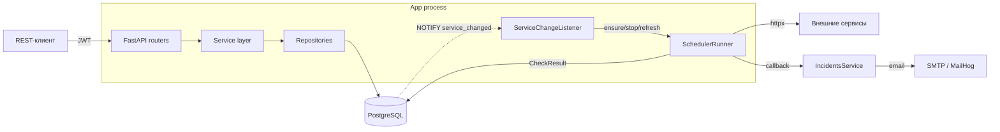

# Rest Assured — Система мониторинга доступности сервисов

[](https://github.com/mipt-pp-hackaton/rest_assured/actions)
[](https://github.com/mipt-pp-hackaton/rest_assured/releases)
[](https://pyproject.toml)
[](https://fastapi.tiangolo.com)
[](https://www.postgresql.org)
[](https://www.docker.com)
[](https://python-poetry.org)

---

## 📋 Описание проекта

**Rest Assured** — это интеллектуальная система мониторинга, предназначенная для автоматической проверки состояния REST-сервисов. Система обеспечивает непрерывный контроль доступности endpoint'ов, рассчитывает показатели **SLA (Service Level Agreement)** и мгновенно уведомляет ответственных лиц в случае сбоев.

> 🖥 **Фронтенд** находится в отдельном репозитории: [mipt-pp-hackaton/rest_assured_frontend](https://github.com/mipt-pp-hackaton/rest_assured_frontend). Этот репозиторий — backend (API + планировщик).

### 🎯 Цель проекта
Разработать надежное решение для мониторинга, которое позволяет минимизировать время простоя (downtime) за счет оперативного оповещения и предоставления детальной статистики аптайма.

---

## ✨ Ключевые возможности

- 🔍 **Автоматический мониторинг**: фоновый планировщик опрашивает каждый зарегистрированный REST-endpoint по индивидуальному интервалу (`interval_ms`).
- ⚙️ **Управление сервисами**: полный CRUD каталога сервисов через REST API (создание, чтение, обновление, удаление).
- 🛡 **Валидация URL**: при регистрации разрешены только `http`/`https`, hostname обязан резолвиться. Приватные/«серые» адреса (10/8, 172.16/12, 192.168/16, loopback, link-local) допускаются — инструмент штатно мониторит и внутренние сервисы. От SSRF-редиректов защищает `httpx`-клиент с `follow_redirects=False`.
- 🔐 **Аутентификация**: JWT (access + refresh токены), пароли хэшируются через bcrypt, провижининг пользователей доступен только администраторам.
- 📈 **SLA и Uptime**: расчёт текущего аптайма, процента SLA и временных рядов (timeseries) с latency p95.
- 🚨 **Инциденты**: автоматическое открытие инцидента при первом сбое и закрытие при восстановлении сервиса.
- 📧 **Умные уведомления**: Email-оповещения через SMTP при инцидентах с защитой от спама (cooldown).
- 📊 **Сводная аналитика**: единый эндпоинт со статусом всех отслеживаемых систем.

---

## 🧰 Технологический стек

| Слой | Технология |
|------|-----------|
| Язык | Python 3.13 |
| Web-фреймворк | FastAPI (`fastapi[standard]`) |
| ORM / модели | SQLModel поверх SQLAlchemy (async) |
| База данных | PostgreSQL (драйвер `asyncpg`) |
| Миграции | Alembic (async `env.py`) |
| HTTP-клиент | httpx (async, shared `AsyncClient`) |
| Конфигурация | Dynaconf + Pydantic (`SecretStr` для секретов) |
| Аутентификация | PyJWT (`pyjwt[crypto]`) + passlib/bcrypt |
| Уведомления | aiosmtplib + Jinja2 |
| Пакетный менеджер | Poetry |
| Качество кода | Ruff (format + lint), mypy |
| Тесты | pytest, pytest-asyncio, pytest-httpx, testcontainers |
| Релизы | python-semantic-release (Conventional Commits) |
| Контейнеризация | Docker (multi-stage) + Docker Compose |

---

## 🏗 Архитектура проекта

Приложение — это FastAPI-сервис с **встроенным фоновым планировщиком**, который живёт внутри того же процесса (никаких отдельных воркеров/Celery). Фабрика `create_app()` (`rest_assured/src/main.py`) создаёт планировщик и listener, регистрирует роутеры и через `lifespan` поднимает/гасит фоновые задачи.

### Общая схема



### Слои приложения

| Слой | Каталог | Назначение |
|------|---------|-----------|
| **API / роутеры** | `api/`, `api/routers/` | HTTP-эндпоинты, валидация запросов, JWT-зависимости |
| **Схемы** | `schemas/` | Pydantic-модели запросов/ответов (DTO) |
| **Бизнес-логика** | `services/` | Каталог, инциденты, метрики, auth, уведомления |
| **Планировщик** | `services/scheduler/` | Фоновый опрос сервисов и классификация ответов |
| **Репозитории** | `repositories/` | Доступ к данным поверх async-сессий SQLModel |
| **Модели** | `models/` | SQLModel-таблицы (`services`, `check_results`, `incidents`, `notification_log`, `users`) |
| **Конфигурация** | `configs/app/` | Pydantic-конфиги из `settings.toml` (Dynaconf) |
| **Миграции** | `alembic/` | Версионирование схемы БД |

Поток обычного запроса: `HTTP → router (Depends-аутентификация) → *Service (бизнес-логика) → *Repository → PostgreSQL`. Сессии БД выдаёт `repositories/database_session.py`: для запросов — FastAPI-зависимость `get_session_dependency` (alias `get_db_session`), для фоновых задач и скриптов — `session_scope()` (async-contextmanager, гарантирует закрытие сессии; `commit`/`rollback` выполняют сами функции репозиториев). При `app_settings.use_testcontainers` движок использует `NullPool`, чтобы тесты не делили пул соединений.

### Подсистема планировщика

Ядро проекта — `rest_assured/src/services/scheduler/`, четыре связанных модуля:

- **`runner.py` — `SchedulerRunner`**: оркестратор. `start()` загружает все `is_active=True` сервисы (3×1s retry; если БД недоступна — стартует с пустым набором, listener восстановит). Создаёт shared `httpx.AsyncClient(follow_redirects=False)` (защита от SSRF-редиректов). Держит `_tasks: dict[service_id, asyncio.Task]` и счётчики (`checks_total`, `checks_failed`, `last_loop_at`). API для listener'а: `active_service_ids()`, `ensure_running(service)`, `stop_service(sid)`, `refresh_service(sid)`. Через `register_callback()` подключаются async-коллбэки, `fire_callbacks(check)` их вызывает.
- **`worker.py` — `worker_loop(runner, service)`**: бесконечный per-service цикл: `sleep(interval_ms)` → httpx-запрос → `evaluate_response(...)` → инкремент счётчиков **до** `commit()` (факт проверки не теряется при падении БД) → `session.commit()` (rollback+log при ошибке, цикл продолжается) → `runner.fire_callbacks(check)`.
- **`evaluate.py` — `evaluate_response(...)`**: pure-функция, возвращает `CheckResult`. Правило успеха: если у сервиса задан `expected_status` — требуется точное совпадение, иначе успех = `200 ≤ status < 300`. В `error` сохраняется `f"{type(exc).__name__}: {str(exc)[:480]}"` (никогда `repr` — он мог бы утечь URL с Basic Auth).
- **`listener.py` — `ServiceChangeListener`**: подписан на PostgreSQL `LISTEN service_changed` через прямое asyncpg-соединение (вне SQLAlchemy-пула, чтобы pool-rotation не убивал подписку). Payload notify — JSON-объект `{"id": <service_id>}`, обрабатывается через `runner.refresh_service(id)`. Параллельно **всегда** работает `_poll_loop()`: каждые `scheduler.poll_interval_seconds` сравнивает `active_service_ids()` со списком из БД и подтягивает изменения (страховка на случай мёртвого `LISTEN` или пропущенных за время дисконнекта `NOTIFY`). Payload/channel прогоняются через `_sanitize_log()` (защита от log-injection).

Изменения каталога (создание/обновление/удаление сервиса) транслируются воркерам почти мгновенно: репозиторий эмитит `pg_notify('service_changed', ...)` → listener вызывает `refresh_service` (= `stop_service` + перечитать строку + `ensure_running`). Poll-loop работает рядом как механизм гарантированной сходимости.

### Модель данных

| Таблица | Назначение | Ключевые поля |
|---------|-----------|---------------|
| `services` | Отслеживаемые сервисы | `url` (валидация схемы + резолвимости), `http_method`, `interval_ms ≥ 1000`, `expected_status?`, `is_active`, `sla_target_pct?`, `owner_emails` (JSON), `created_by → users.id` |
| `check_results` | Результат одной проверки | `service_id → services.id`, `checked_at`, `is_up`, `http_status?`, `latency_ms?`, `error?` — индекс `(service_id, checked_at DESC)` |
| `incidents` | Интервал недоступности | `service_id`, `opened_at`, `closed_at?` (NULL = открыт), `last_error?`, `sla_breach` |
| `notification_log` | Лог отправленных уведомлений | `incident_id?`, `service_id`, `kind`, `sent_at`, `recipients`, `subject`, `error?` |
| `users` | Пользователи (JWT) | `email` (unique), `password_hash` (bcrypt), `is_active`, `is_superuser` |

Все `datetime`-поля — **tz-aware UTC** (`DateTime(timezone=True)`). Состояние инцидента кодируется nullable-колонкой `closed_at` (`NULL` = открыт); повторное открытие предотвращается поиском уже открытого инцидента (`find_open_incident`) и unique-ограничением на уровне БД (миграция 004).

### Структура каталогов

```
rest_assured/src/
  main.py                       # create_app() + lifespan (runner + listener)
  cli.py                        # CLI: server / migrate
  api/
    misc.py                     # /health
    dependencies.py
    routers/                    # auth, services, scheduler, incidents, metrics
  schemas/                      # Pydantic DTO для запросов/ответов
  services/
    catalog.py  incidents.py  metrics.py  metrics_service.py
    auth/                       # service, jwt, passwords, dependencies
    notifications/email.py      # EmailSender (aiosmtplib + Jinja2)
    scheduler/                  # runner, worker, evaluate, listener
  repositories/                 # database_session + per-сущность репозитории
  models/                       # SQLModel-таблицы
  configs/app/                  # Settings из settings.toml (Dynaconf)
  alembic/                      # миграции (env.py async)
  scripts/seed.py               # admin + демо-сервисы
  utils/version.py              # get_app_version()

rest_assured/tests/                 # unit
rest_assured/integrational_tests/   # требует Docker (testcontainers Postgres)
docker/                             # docker-compose.{test,prod}.yml
```

---

## 🌐 API — эндпоинты

Базовый адрес по умолчанию — `http://localhost:8000`. Интерактивная документация (Swagger UI) доступна на **`/docs`**, ReDoc — на **`/redoc`**, OpenAPI-схема — на **`/openapi.json`** (в рантайме) либо в виде статического файла `openapi.json` в корне репозитория (генерируется `make openapi`).

> ℹ️ Глобального префикса (`/api/v1` и т.п.) нет — каждая группа роутеров несёт свой собственный префикс.

**Уровни доступа:**

| Значок | Уровень | Требование |
|:---:|---------|-----------|
| 🔓 | анонимный | токен не нужен |
| 🔑 | пользователь | валидный access-токен + `is_active` (`get_current_active_user`) |
| 👑 | администратор | дополнительно `is_superuser` (`get_current_superuser`) |

### 🔐 Аутентификация — `/api/auth`

| Метод | Путь | Доступ | Описание |
|-------|------|:---:|----------|
| `POST` | `/api/auth/login` | 🔓 | Вход по email/паролю (OAuth2 password form, поле `username` = email). Возвращает пару `access` + `refresh`. |
| `POST` | `/api/auth/refresh` | 🔓 | Обмен refresh-токена на новую пару токенов. |
| `POST` | `/api/auth/register` | 👑 | Создание нового пользователя (только админ). |
| `GET`  | `/api/auth/me` | 🔑 | Профиль текущего пользователя. |

- **Запрос `login`** — форма `application/x-www-form-urlencoded`: `username` (email), `password`.
- **Запрос `refresh`** — `RefreshRequest { refresh_token }`.
- **Запрос `register`** — `UserCreate { email, password (8–72 симв.), is_superuser=false }`.
- **Ответ `login`/`refresh`** — `TokenPair { access_token, refresh_token, token_type="bearer" }`.
- **Ответ `register`/`me`** — `UserRead { id, email, is_active, is_superuser, created_at, updated_at }`.
- Авторизация защищённых запросов: заголовок `Authorization: Bearer <access_token>`.

### ⚙️ Каталог сервисов — `/api/services`

| Метод | Путь | Доступ | Описание |
|-------|------|:---:|----------|
| `GET`    | `/api/services/` | 🔑 | Список всех зарегистрированных сервисов. |
| `POST`   | `/api/services/` | 🔑 | Регистрация нового сервиса (`201 Created`). |
| `GET`    | `/api/services/{service_id}` | 🔑 | Один сервис по `id` (`404` если не найден). |
| `PATCH`  | `/api/services/{service_id}` | 🔑 | Частичное обновление (все поля опциональны). |
| `DELETE` | `/api/services/{service_id}` | 🔑 | Удаление сервиса (`204 No Content`). |

- **Запрос `POST`** — `ServiceCreate { url, name, http_method=GET, interval_ms=60000, expected_status?, is_active=true, owner_emails=[] }`. `http_method ∈ {GET, POST, HEAD, PUT, DELETE, PATCH, OPTIONS}`, `interval_ms ≥ 1000`. URL валидируется (схема `http`/`https` + резолвимость hostname; приватные адреса допускаются). `owner_emails` — адреса для incident-уведомлений (валидируются как email).
- **Ответ** — `ServiceRead { id, url, name, http_method, interval_ms, expected_status, is_active, owner_emails, created_at }`.

### 📈 Метрики — `/api/services`

| Метод | Путь | Доступ | Описание |
|-------|------|:---:|----------|
| `GET` | `/api/services/summary` | 🔑 | Сводка по всем сервисам: аптайм, SLA %, статус последней проверки. |
| `GET` | `/api/services/{service_id}/metrics` | 🔑 | Текущий аптайм (сек) и SLA % одного сервиса. |
| `GET` | `/api/services/{service_id}/timeseries` | 🔑 | Временной ряд: счётчики, up-ratio, latency avg/p95 по бакетам. |

- **`summary`** → `list[ServiceSummaryItem] { service_id, name, url, is_active, current_uptime_seconds, sla_pct, last_check_at?, last_check_is_up? }`.
- **`metrics`** → `ServiceMetricsResponse { service_id, current_uptime_seconds, sla_pct, computed_at }`.
- **`timeseries`** — query-параметры: `from` (datetime, обязателен), `to` (datetime, обязателен), `bucket_seconds` (10–3600, по умолч. 60). Возвращает `list[TimeseriesBucket] { bucket_start, checks_total, checks_up, up_ratio, latency_avg_ms?, latency_p95_ms? }`. `422`, если `to ≤ from`.

### 🚨 Инциденты — `/api/incidents`

| Метод | Путь | Доступ | Описание |
|-------|------|:---:|----------|
| `GET` | `/api/incidents` | 🔑 | Список инцидентов с фильтрами. |

- **Query-параметры**: `service_id?`, `open?` (`true` — только открытые, `false` — только закрытые), `sla_breach?`, `limit` (1–500, по умолч. 100).
- **Ответ** — `list[IncidentRead] { id, service_id, service_name, opened_at, closed_at?, last_error?, sla_breach, duration_seconds? }`.

### 🩺 Служебные — health & scheduler

| Метод | Путь | Доступ | Описание |
|-------|------|:---:|----------|
| `GET` | `/health` | 🔓 | Liveness-проверка приложения → `{ "status": "ok" }`. |
| `GET` | `/api/health/scheduler` | 🔑 | Статистика планировщика (`checks_total`, `checks_failed`, `active_workers_count`, `last_loop_at`). |
| `GET` | `/metrics` | 🔓 | Prometheus-экспозиция (см. ниже). Доступ ограничивается на сетевом уровне. |

### 📊 Наблюдаемость (observability)

«Мониторинг самого мониторинга»:

- **Prometheus `/metrics`** — для Grafana/Alertmanager. Доменные метрики планировщика читаются прямо из живых счётчиков раннера (тот же источник, что и `/api/health/scheduler`):
  - `rest_assured_checks_total`, `rest_assured_checks_failed_total` — счётчики проверок;
  - `rest_assured_active_workers` — число активных per-service воркеров;
  - `rest_assured_scheduler_last_loop_timestamp_seconds` — отметка последнего цикла (алерт «планировщик завис», если давно не растёт);
  - `rest_assured_http_requests_total{method,status}`, `rest_assured_http_request_duration_seconds` — метрики HTTP API.
- **Структурированное логирование (JSON)** — **включено по умолчанию**: loguru `serialize` + заворачивание stdlib-логов (планировщик, uvicorn) в единый JSON-поток для ELK/Loki/Datadog. Отключить (человекочитаемые логи для локальной отладки) — `DYNACONF_LOGGING__JSON_LOGS=false`. Защита от log-injection (`_sanitize_log`) и `diagnose=False` (секреты не попадают в traceback). Под pytest перехват не применяется, чтобы не ломать `caplog`.

---

## 👤 Пользовательские сценарии (User Stories)

1. **Регистрация сервиса**: специалист поддержки через API добавляет URL для мониторинга.
2. **Настройка SLA**: для каждого сервиса задаётся целевой процент доступности и список Email ответственных.
3. **Цикл проверки**: планировщик в фоне опрашивает сервисы; при ошибке/таймауте фиксируется инцидент.
4. **Оповещение**: при сбое система отправляет письмо ответственному сотруднику.
5. **Анализ**: менеджер запрашивает сводную статистику и timeseries для проверки выполнения SLA.

---

## 🚀 Инструкции по запуску

### Вариант 1. Docker (рекомендуется)

**Dev-окружение** (приложение + PostgreSQL + MailHog, hot-reload):
```bash
make ddev      # docker/docker-compose.test.yml
```

**Prod-окружение** (приложение + PostgreSQL + тестовый сервис + MailHog):
```bash
make dprod     # docker/docker-compose.prod.yml — нужен .env (см. .env.example)
```

Порты: API — `8000`, PostgreSQL — `5432`, MailHog SMTP — `1025`, MailHog Web UI — `8025` (`http://localhost:8025`). Контейнер приложения сам прогоняет `alembic upgrade heads` при старте.

### Вариант 2. Локальный запуск (без Docker)

```bash
# 1. Зависимости
poetry install --with dev

# 2. Конфигурация: скопировать пример и заполнить (файл в .gitignore)
cp settings.toml.example settings.toml
#    как минимум задать db_settings.* и сгенерировать jwt.secret:
#    openssl rand -hex 32

# 3. Применить миграции (нужен поднятый PostgreSQL)
make migrate

# 4. (опц.) Засеять админа и демо-сервисы
make seed                          # = python3 -m rest_assured --seed
#    идемпотентно, через сервисный слой (Auth/Catalog): создаёт суперюзера
#    admin@admin.com / admin + демо-сервисы; повторный запуск не создаёт дублей

# 5. Запустить сервер
make dev       # uvicorn с hot-reload
# или
make run       # production uvicorn
```

После старта открой **`http://localhost:8000/docs`** — Swagger UI со всеми эндпоинтами.

### Конфигурация

Настройки берутся из `settings.toml` (Dynaconf). Любой ключ можно переопределить переменной окружения с префиксом `DYNACONF` и разделителем `__`, например `DYNACONF_DB_SETTINGS__HOST=...`, `DYNACONF_JWT__SECRET=...`. Секции: `[app_settings]`, `[db_settings]`, `[scheduler]`, `[metrics]`, `[smtp]`, `[notifications]`, `[jwt]`. Секреты (`db_settings.password`, `jwt.secret`, `smtp.password`) хранятся как `SecretStr`.

---

## 🧪 Тестирование и проверка

Проект включает модульные и интеграционные тесты:

- **Unit-тесты**: `make utest`
- **Интеграционные тесты**: `make itest` (требуют Docker — testcontainers поднимает PostgreSQL)
- **Проверка качества кода**: `make lint && make type`
- **Автоформат**: `make format` (Ruff)

Один тест запускают стандартным pytest-селектором, например:
```bash
poetry run pytest rest_assured/tests/scheduler/test_runner_filter.py::test_start_spawns_only_active_services -v
```

---

## 🧭 Процесс работы над задачами

Все задачи отслеживаются в [GitHub Issues](https://github.com/mipt-pp-hackaton/rest_assured/issues). Эпики помечены лейблом `epic`, конкретные таски — `epic:1-catalog`, `epic:2-checks`, `epic:3-metrics`, `epic:4-notifications`, `epic:5-ui`.

### Шаг 1. Выбрать тикет

1. Открой [список открытых issues](https://github.com/mipt-pp-hackaton/rest_assured/issues).
2. Найди свободный тикет (без `assignees`) в нужном эпике.
3. Назначь себя через **Assignees → assign yourself** в правой панели.
4. Внимательно прочитай разделы **Зависит от**, **Что сделать**, **Тесты**, **DoD** — это полный контракт задачи.

### Шаг 2. Создать ветку

Имя ветки: `T<номер_эпика>.<номер_таски>-<краткое-описание-кебаб-кейсом>`. Базовая ветка — `main`.

```bash
git checkout main
git pull origin main
git checkout -b T1.1-fix-cli-imports
```

### Шаг 3. Решить задачу

1. Реализуй все пункты из раздела **Что сделать** в тикете.
2. Напиши тесты, перечисленные в разделе **Тесты**.
3. Прогони локально:
   ```bash
   make lint && make type && make utest && make itest
   ```
4. Коммить маленькими атомарными коммитами в формате [Conventional Commits](https://www.conventionalcommits.org/ru/v1.0.0/) — подробнее в разделе ниже [«Conventional Commits»](#-conventional-commits--формат-сообщений).

### Шаг 4. Создать Pull Request

1. Запушь ветку:
   ```bash
   git push -u origin T1.1-fix-cli-imports
   ```
2. Открой PR в GitHub: **Compare & pull request**.
3. Заполни:
   - **Title**: `T1.1 — Фикс импорта в src/cli.py` (тот же, что у тикета).
   - **Description**: добавь строку `Closes #27` (номер своего тикета — это автоматически закроет issue после мерджа).
   - Кратко опиши, что сделано и какие тесты проходят.
4. **Reviewers → AndreyQuantum** (правая панель PR).
5. **Labels**: проставь тот же label эпика, что и у тикета (например `epic:1-catalog`).

### Шаг 5. Дождаться ревью

- CI должен быть зелёным (lint + tests + типы).
- Если ревьюер оставил комментарии — фикси, пушь в ту же ветку, отвечай на комменты с **Resolve conversation**.
- После аппрува ревьюер мерджит PR в `main` (squash merge).

### Полезные команды

```bash
# посмотреть свои тикеты
gh issue list --assignee "@me"

# создать PR прямо из CLI
gh pr create --reviewer AndreyQuantum --label epic:1-catalog --body "Closes #27"

# проверить статус CI у текущей ветки
gh pr checks
```

---

## ✍️ Conventional Commits — формат сообщений

Каждый коммит следует [Conventional Commits 1.0.0](https://www.conventionalcommits.org/ru/v1.0.0/). Это критично — Semantic Release читает историю и автоматически рассчитывает следующую версию (см. [Процесс релиза](#-процесс-релиза)).

### Формат

```
<type>(<scope>): <subject>

[body]

[footer]
```

- **type** — категория изменения (см. таблицу ниже).
- **scope** *(опц., но желательно)* — короткое имя модуля/компонента: `auth`, `scheduler`, `metrics`, `incidents`, `ui`, `api`, `db`, `cli`, `docker`.
- **subject** — императив, нижний регистр, без точки в конце, ≤ 72 символов.
- **body** *(опц.)* — что и зачем; **не пересказывай diff**, объясняй мотивацию.
- **footer** *(опц.)* — `Closes #N`, `Refs #N`, `BREAKING CHANGE: ...`.

### Типы

| Тип        | Когда использовать                                                       | Влияние на версию          |
|------------|--------------------------------------------------------------------------|----------------------------|
| `feat`     | Новая функциональность (видна пользователю / в API)                      | minor (`0.1.0` → `0.2.0`)  |
| `fix`      | Исправление бага                                                          | patch (`0.1.0` → `0.1.1`)  |
| `perf`     | Улучшение производительности без смены поведения                          | patch                      |
| `refactor` | Рефакторинг без новой функциональности и без багфикса                     | —                          |
| `docs`     | Только документация (README, ARCHITECTURE, docstrings)                   | —                          |
| `test`     | Добавление или правка тестов                                              | —                          |
| `style`    | Форматирование, отступы — без изменения логики                            | —                          |
| `build`    | Сборка, зависимости (poetry, pip, docker)                                | —                          |
| `ci`       | Изменения в GitHub Actions / pipeline                                    | —                          |
| `chore`    | Прочие технические правки, не попадающие в остальные                     | —                          |

### Примеры

```
feat(auth): add JWT login endpoint with bcrypt password hashing
fix(cli): correct package import path from personal_assistant to rest_assured
refactor(scheduler): extract callback registry into separate class
docs(readme): add contributor workflow guide
test(metrics): cover compute_sla edge cases (empty list, single item)
chore(deps): bump httpx from 0.27 to 0.28
perf(api): use DISTINCT ON instead of N+1 in /summary endpoint
```

### Breaking change

Триггерит major bump (`1.2.3` → `2.0.0`). Два эквивалентных способа:

```
feat(api)!: rename POST /api/services to POST /api/services/register
```

или с блоком в footer:

```
feat(api): rename POST /api/services to POST /api/services/register

BREAKING CHANGE: клиенты должны переключиться на новый URL.
```

### Связь с тикетом

- Финальный коммит (или PR description) → `Closes #N` — закрывает issue при мердже.
- Промежуточный коммит, частично относящийся к задаче → `Refs #N` в footer'е.

```
feat(metrics): add timeseries endpoint

Реализует пункт T3.5: бакетирование check_results через date_trunc.

Refs #48
```

### Чек перед коммитом

- [ ] Тип выбран корректно (`feat` ≠ `fix`, не путай с `chore`).
- [ ] Scope соответствует затронутому модулю.
- [ ] Subject в императиве, без точки, ≤ 72 символов.
- [ ] Если ломаешь обратную совместимость — есть `!` или `BREAKING CHANGE:`.
- [ ] Один коммит = одно логическое изменение (не сваливай feat + refactor + docs в один).

---

## 🔄 Процесс релиза

Мы используем **Semantic Release** для автоматизации:
- `fix:` -> обновление патч-версии.
- `feat:` -> обновление минорной версии.
- `BREAKING CHANGE:` -> обновление мажорной версии.

Каждый релиз автоматически создает тег, обновляет `CHANGELOG.md` и пересобирает Docker-образ с актуальной версией.
